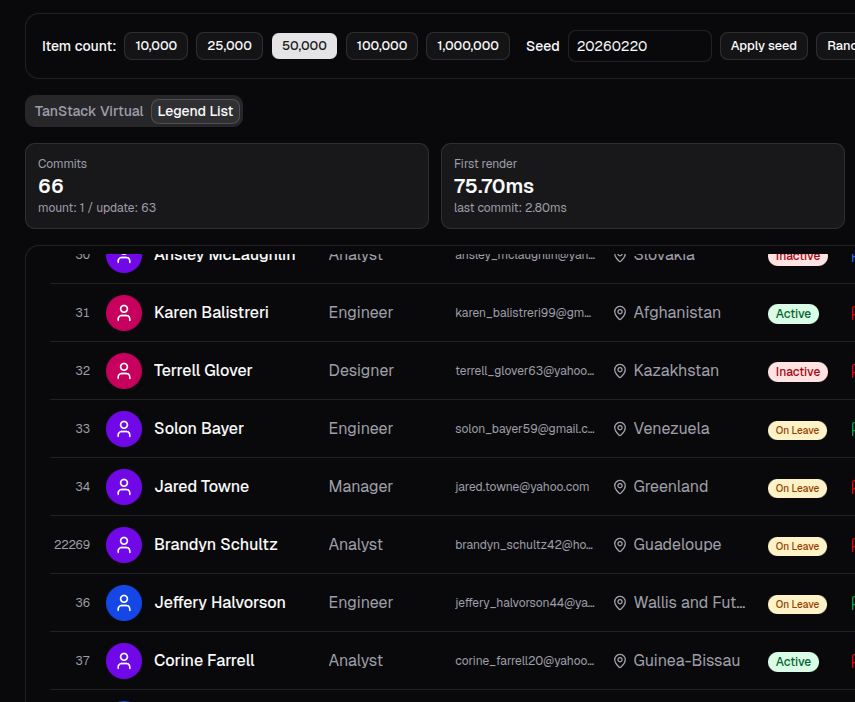
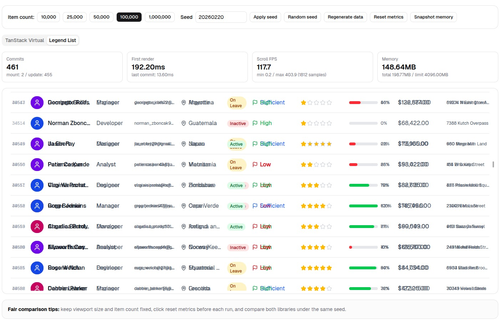
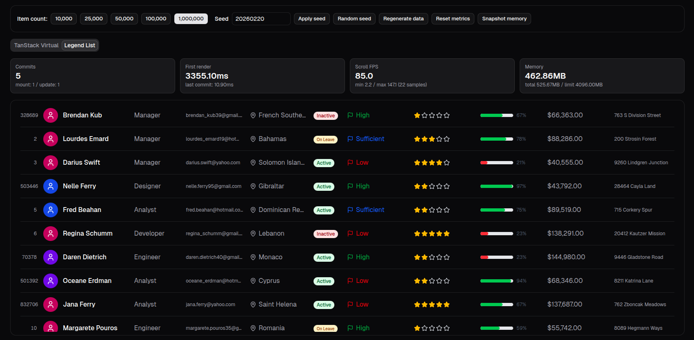
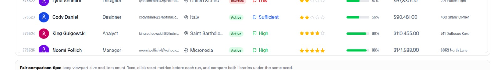
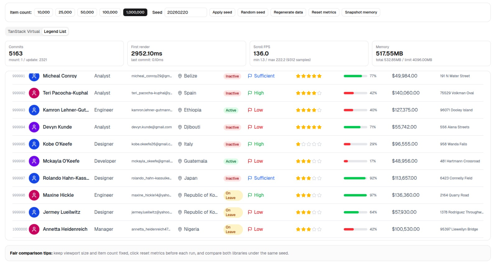

# Legend vs TanStack List Benchmark

This repository is a React + TypeScript benchmark harness for comparing large-list rendering performance between Legend List and TanStack Virtual under identical dataset and UI conditions, with room to add more libraries over time.

This is my first time building a benchmark, so parts of the setup or methodology may be imperfect. I used GPT-5.3-Codex to help put this project together.

## Benchmark Setup

### Simple Setup

1. Install dependencies:

```bash
pnpm install
```

2. Start the benchmark app:

```bash
pnpm run dev
```

3. Open the local URL printed by Vite (usually `http://localhost:5173`).
4. Run each item count (10K, 25K, 50K, 100K, 1M) for both implementations.
5. Record first render time, scroll FPS, and memory for each run.

### Tooling Versions

- node: v22.21.0
- pnpm: 10.15.1

### Libraries Tested

| Library          | Version       |
| ---------------- | ------------- |
| Legend List      | 3.0.0-beta.33 |
| TanStack Virtual | ^3.13.18      |

### Browsers Tested

| Browser  | Version | Notes                   |
| -------- | ------- | ----------------------- |
| Helium   | 0.7.6.1 | Chromium 143.0.7499.146 |
| Firefox  | 147.0.4 | Gecko                   |
| Epiphany | 46.5    | WebKit                  |

### Hardware Tested

- OS: Pop!\_OS 24.04 COSMIC (kernel 6.18.7-76061807-generic, arch x86_64)
- CPU: Intel i7-9750H (12) @ 4.500GHz
- GPU: NVIDIA GeForce GTX 1660 Ti Mobile

### Metrics Tracked

- Item counts tested: 10K, 25K, 50K, 100K, 1M
- React Profiler metrics
- First render time (ms)
- Scroll frames per second (FPS)
- Memory usage (MB)

## Findings

These findings are more anecdotal and experimental than strictly scientific. I combined how the UI felt during manual interaction with the recorded metrics, since I'm not fully sure how to formalize visual UI testing in this benchmark.

> Disclaimer: the numbers discussed below are from my machine, and I generally use Helium as the reference browser for the numeric comparisons.

Item count range used in findings: 10K to 1M items.

### React Profiler Metrics

- For both libraries (Legend List and TanStack Virtual), the Profiler behavior was consistent in all tested browsers: one mount commit, then update commits while scrolling.

### First Render Time

- TanStack Virtual looked O(1)-like in practice: first render time stayed around 10-30ms from 10K to 100K items, then increased at 1M items to about 75ms.
- Legend List first render time increased with item count and looked O(n)-like in practice.
- The following function approximates the first render time for Legend List:

```ts
const render = (count: number) => Math.floor((1.7 * count) / 1000 / 10) * 10;
```

| Item Count | TanStack Virtual FRT (ms) | Legend List FRT (ms)                   |
| ---------- | ------------------------- | -------------------------------------- |
| 10K        | ~10-30                    | ~10                                    |
| 25K        | ~10-30                    | ~40                                    |
| 50K        | ~10-30                    | ~80                                    |
| 100K       | ~10-30                    | ~170                                   |
| 1M         | ~75                       | ~1700 to ~3000, depending on situation |

**Note:** I know the 1M-row case is a bit absurd for many real-world UIs, but it is still interesting to test as a stress case.

### Scroll Frames Per Second

- Scroll FPS was pretty similar between both libraries across most item counts.
- Legend List seemed to keep FPS a bit higher at higher item counts (see [Rendering Caveat](#rendering-caveat)).
- Firefox scrolling was surprisingly smoother than Helium in practice, with no white / empty items reached, especially with Legend List.

### Memory Usage

- Memory usage showed no meaningful difference between Legend List and TanStack Virtual in my tests.

### Rendering Caveat

- In my runs, Legend List starts showing rendering issues from around 50K items and up.
- The issues include wrong scroll offsets and cases where some items do not render at all.

<details>
<summary>Item at wrong scroll offset at 50K screenshot</summary>



</details>

<details>
<summary>Items not rendering at 100K screenshot</summary>


</details>

<details>
<summary>Legend item overlap screenshot</summary>



</details>

- At 1M items, Legend List shows no items on initial render and only starts showing rows after scrolling.
- In my tests, the 1M case only worked in Helium: Epiphany crashed, and Firefox appeared to treat the `100_000_000px` container as `0px` height.

<details>
<summary>Legend List at 1M initial view (items rendered after scroll)</summary>



</details>

### Positive Note

- The 1M-item stress also breaks TanStack Virtual, so this extreme limit is not specific to Legend List.
- In Epiphany, TanStack Virtual crashed.
- In Firefox, TanStack Virtual only rendered the first 95 items.
- In Helium, TanStack Virtual rendered some items but not all of them (see screenshot below).

<details>
<summary>TanStack Virtual at 1M in Helium (partial rendering)</summary>



</details>

- Even with those rendering issues, Legend List could still render the end / near-end portion of the 1M-row dataset in some runs.

<details>
<summary>Legend List at 1M near end of list (rendered)</summary>



</details>
